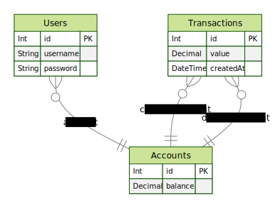

# Transfer Between Piggy Banks

Esta é uma aplicação web fullstack, dockerizada, cujo objetivo seja possibilitar que os usuários consigam realizar transferências internas entre si.

Para construir esse projeto foram utilizadas as seguinte tecnologias:

- 🔷 Eslint - Para padronização de código
- 🐙 Git - Para versionamento de código

Back-end 🧑‍💻

- NodeJS
- TypeScript
- Docker
- Prisma
- PostgresDB
- Express
- Swagger

Front-end 🧑‍💻

- React
- TypeScript
- Docker
- Axios
- Vite

## Como fazer para rodar a aplicação:

- Na raiz do projeto rode o comando `npm run prestart`.
  - Aqui instala as dependencias de back-end e front-end e sobe os containers para uso. Assim pode acessar pelo navegador `localhost:3000` para acessar o front-end e/ou `localhost:3001/api-docs/` para ver a documentação da API.

> 🧑‍💻 Para ambiente de desenvolvimento `npm run compose-up:dev`

## Back-end

### Requisições da Api / Database

> - Confira a [documentação](http://localhost:3001/api-docs/) da api feita com `swagger` na rota `http://localhost:3001/api-docs/` > **Obs.** Esta rota esta disponível somente com os containers rodando
> - Confira também os padrões de projeto [aqui](./backend/README.md) `backend/README.md`

- Rota de registro

  > - `/register` _Responsavel pelo cadastro de novos usuários_

- Rota de login

  > - `/login` _Responsavel pelo acesso de usuários e gerar um token_

- Rota de transferencia de credito

  > - `/transaction` _Responsavel pela transação de credito entre usuarios do banco de dados_

- Rota para buscar saldo da conta

  > - `/balance/:id` _Responsavel por buscar valor de "balance" na tabela de "Account" do usuário verificado_

- Rota para buscar historico de transações
  > - `/transaction/:id` _Responsavel por buscar todo o historico de transações feitas pelo usuário_

### Testes

Para rodar os testes do back-end

- Entre na pasta de back-end

  - `cd backend/`

- Execute o teste
  - `npm test`

👀  Não ah necessidade do container estar rodando para executar os testes, foram feitos mocks para todos os testes.

### Diagrama de Entidade Relacionamento

## Front-end

Embora o design ainda esteja simples, há duas rotas disponíveis para o usuário: a rota de acesso, que inclui as opções de login e registro, e a home, onde é possível visualizar as informações do usuário, como seu saldo e o histórico de transações. O histórico de transações inclui filtros de pesquisa para facilitar a visualização das informações e há também um botão que permite ao usuário realizar uma nova transação.

### Testes

👨‍💻 Em breve! Os testes do front-end serão meu proximo passo deste projeto.
